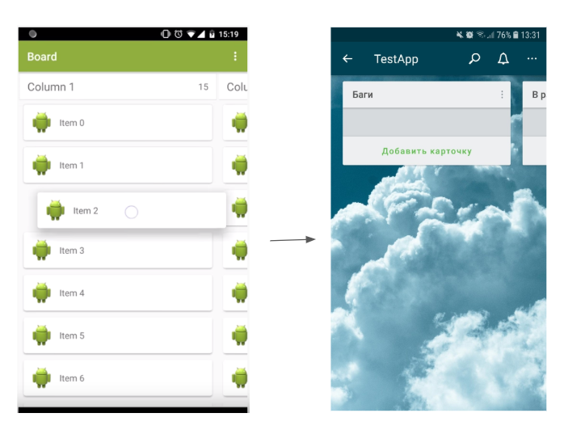
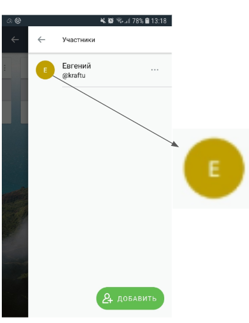

## Домашнее задание по лекции "View/ViewGroup"

**Задача 1: DragListView**: 

Заимплементить библиотеку DragListView для отображения списков задач.

- Добавить новый экран с отображанием доски задач;
- Экран с доской должен содержать 3 столбца: ToDo, InProgress, Completed;
- Добавить кнопку плюс в заголовке каждого столбца (где имя колонки, по правому краю), при нажатии на нее в колонку добавляется новый моковый (произвольный) элемент;
- Заполнить столбцы моковыми (произвольными) данными (5-10 элементов в столбце).

**Задача 2: CustomView**: 

Реализовать CustomView для отображения аватарки пользователя (наследуемся от AppCompatImageView). Входные данные можно передавать через xml.

View работает в 2х режимах:
- При отсутствии аватарки показывает заглушку в виде круга с буквой (по первой букве имени пользователя). Должна быть возможность задать цвет фона и буквы;
- При наличии аватарки показывает скругленную картинку.

На экране создания доски добавить временную кнопку для перехода на активность с несколькими объектами CustomView, работающими в разных режимах.
- Первая CustomView показывает заглушку с произвольным цветом фона и буквой;
- Вторая CustomView показывает аватарку пользователя (добавить в папку drawable произвольную картинку для аватарки пользователя).

