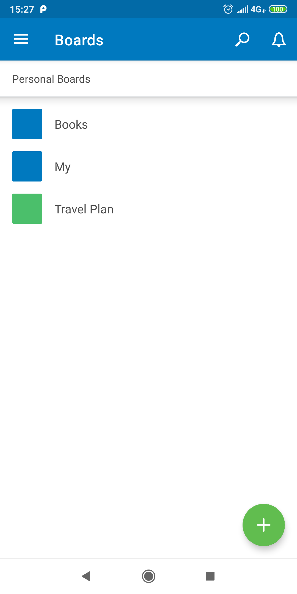

## Домашнее задание по лекции "RecyclerView"

**Задача 1: Подготовка:**
- На экране списка досок модифицируем добавление досок. Для создания доски теперь надо выбрать категорию. Категории захардкожены (**Personal boards**, **Work boards**, **Other boards**). Для выбора можно воспользоваться Spinner'ом.

**Задача 2: работа с recycler view

- На экране списка досок сделать разбиение на типы элементов: сначала идет название категории бордов(хедер) дальше сами доски (Hint: работа с view type)
- После создания новой доски: добавлять ее в рандомно выбранную группу и обновлять список через diffUtils (Hint: работа с DiffUtil.Callback)
- Реализовать возможность перемещения доски драг-н-дропом из одной группы в другую (Hint: работа с ItemTouchHelper / ItemTouchHelper.SimpleCallback)
- Свайпом в любую сторону доска должна удаляться. Если досок в группе нет - группа тоже удаляется (Hint: работа с ItemTouchHelper / ItemTouchHelper.SimpleCallback)
- Если ни досок ни группы нет - показывать заглушку (Hint: работа с view type)

